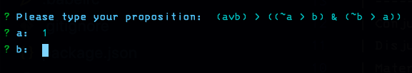
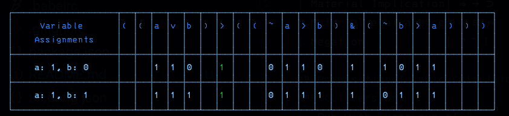

# Logic Calculator

Logic Calculator takes a logical proposition, and evaluates it to produce a truth table.  
Truth tables demonstrate under which models the proposition will be true, and under which models it will be false.  
It is also possible to define parts of the model before evaluation, to restrict output (for example, only show models where a = true)

---

Logic Calculator can be run in the browser by running a local server, or through the command line.  
At the moment, there is only a propositional logic calculator, but there are plans to build a version capable of evaluating predicate logic.

---
In any case, the user will need to input a syntactically valid logical proposition (be careful with your parentheses!).  
Given that many of the operators used in logical formulas are not available on a keyboard, I have mapped each of them to a specific keyboard character (or in the case of material equivalence, two characters), as seen below:

| Name                | Operator      | Character(s)  |
| ------------------- | ------------- | ------------- |
| Conjunction         | ∧ · &         | &             |
| Disjunction         | ∨ ∥           | v             |
| Material Implication| ⇒ → ⊃         | >             |
| Material Equivalence| ⇔ ≡ ↔         | <>            |
| Negation            | ¬ ˜ !         | ~             |

## Propositional Logic Calculator
### CLI Version
1. Run with `yarn run-cli`
2. Type in a proposition  

3. Define your model  
    For each variable used in the proposition, you can specify a truth value (`1` / `0`) to restrict the output of the table, or simply hit enter to leave it undefined. In the following example, `a` is set to `1`, so the table will only show rows in which `a` is true. `b` is left undefined, so rows will be shown for when `b` is set to true, and false.

4. Hit enter & see the result
